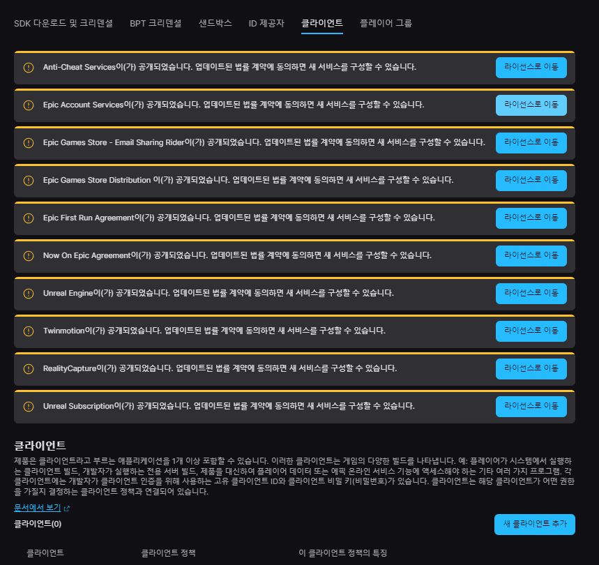
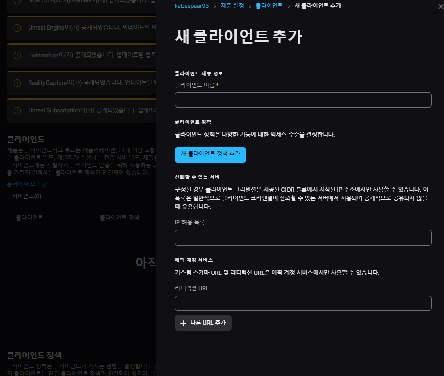
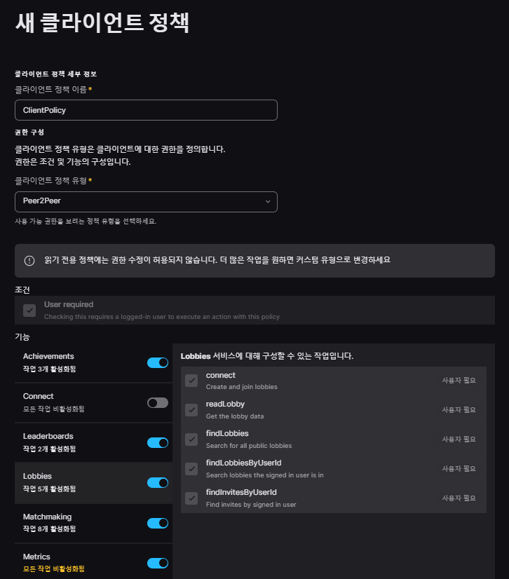
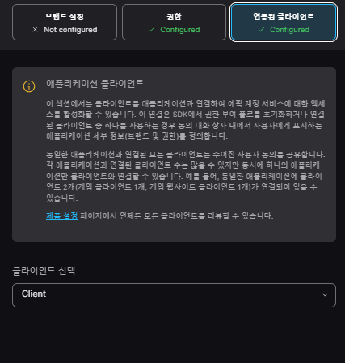
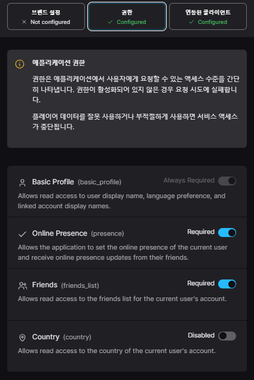

# EOS 세팅하기

## 튜토리얼

[https://dev.epicgames.com/community/learning/courses/1px/unreal-engine-the-eos-online-subsystem-oss-plugin/mMoq/unreal-engine-plugin-configuration](https://dev.epicgames.com/community/learning/courses/1px/unreal-engine-the-eos-online-subsystem-oss-plugin/mMoq/unreal-engine-plugin-configuration)

상위 링크를 통하여 단계별로 학습을 할 수 있다.

## EOS ONLine Dev Potal

[https://dev.epicgames.com/](https://dev.epicgames.com/)

상위 개발자 사이트를 방문하여 등록하고 데시보드를 사용하여 언리얼의 EOS를 사용할 수 있다.

1. 조직을 만든다.
 - 조직을 생성하여 개발을 할 수 있는 환경을 만든다.
2. 제품(Product)를 생성한다.
 - 제품을 생성하여 연동하고자 하는 프로젝트에 연결해 줄 수 있는 환경을 만든다.
3. 클라이언트를 생성한다.

 - 동의 서명을 클릭한다.
 - 클라이언트를 생성한다

 - 클라이언트 새팅을 해준다(lisence server용)
 (참고 : dedicated server의 경우 추후 만들어 볼것이다.)

4. Eplic account services
 - 에픽 계정 서비스를 생성해주어 상위에 만든 클라이언트를 넣어준다
 
 
5. 제붕 설정에 EOS SKD 크리덴셜을 확인한다

4. SDK를 다운받는다.
 - Software Developer Kit를 다운받아 ㅇ

## 플러그인 방법

[https://dev.epicgames.com/documentation/ko-kr/unreal-engine/the-eos-online-subsytem-oss-plugin?application_version=4.27#EOS-Settings]
(https://dev.epicgames.com/documentation/ko-kr/unreal-engine/the-eos-online-subsytem-oss-plugin?application_version=4.27#EOS-Settings)

상위 코드를 들어가서 플러기인 해야한느 것들을 추가한다

